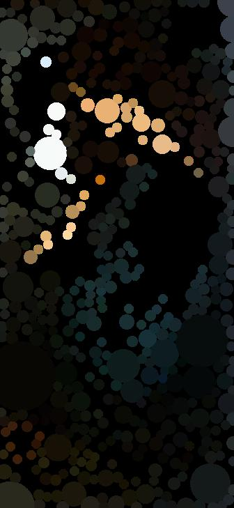
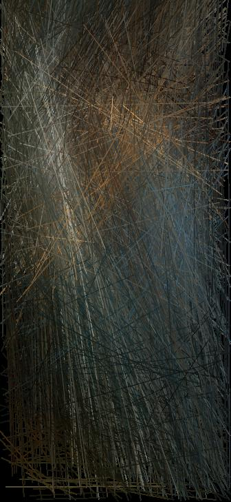

# Ataecina

Reborn your images by converting them to art.

Original                   |  Circled image            |  Linified image
:-------------------------:|:-------------------------:|:-------------------------:
  |    | 

Proserpine painted by
[Dante Gabriel Rosetti](https://en.wikipedia.org/wiki/Dante_Gabriel_Rossetti) in the
[public domain](https://commons.wikimedia.org/wiki/File:Dante_Gabriel_Rossetti_-_Proserpine_-_Google_Art_Project.jpg).

## Converters

### Circler
- It converts an image to a circle-based image.
- Circles are set in a position by random.
- The number of circles, the color and width stroke can be set.

### Linifier
- Convert an image to a segment-based image.
- Segments are set in a position by random.
- The number of lines and width stroke can be set.

## Executables

All converters have a main program in the bin directory:
- random_circler.
- random_linifier.

All executables have many options that are self-explanatory.

## Dependencies
- numpy.
- pillow.

## TODO
- [] Triangle conversion.
- [] Improve performance.
- [] Tests.
- [] CI
