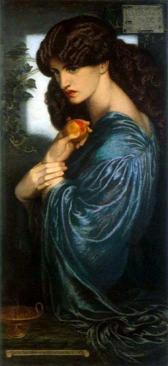

# Ataecina

Reborn your images by converting them to art.

Proserpine painted by
[Dante Gabriel Rosetti](https://en.wikipedia.org/wiki/Dante_Gabriel_Rossetti) in the
[public domain](https://commons.wikimedia.org/wiki/File:Dante_Gabriel_Rossetti_-_Proserpine_-_Google_Art_Project.jpg).

## Converters
### Linifier
Convert an image to a line-based image.
The number of lines and width stroke can be set.

## Dependencies
- numpy.
- pillow.

## TODO
- [] Triangle conversion.
- [] Improve performance.
- [] Tests.
- [] CI
